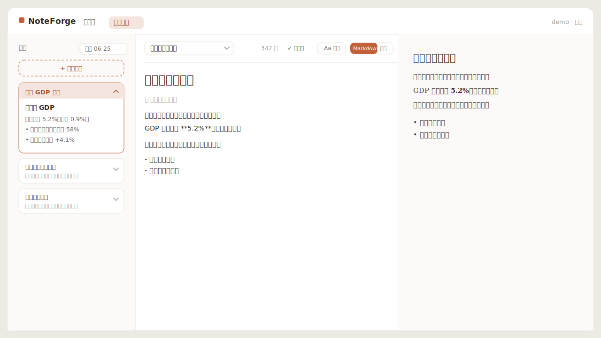
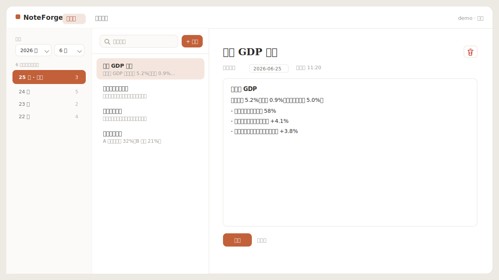

<div align="center">

# 🔥 NoteForge

### 把每天收集的资料，锻造成你的文章

**左边沉淀资料，右边安心写作。** 一个资料归档与写作二合一的个人工作台 —— 按天归档你收集的资料与数据，在一个干净漂亮的写作中心里，边看资料边把它们写成成稿。

<br/>


<br/>



</div>

---

## ✨ 特性

- 🗂️ **按天归档资料** —— 每天收集的资料、数据各成一份，按「年 → 月 → 日」层层归档，随时翻回历史。
- ✍️ **漂亮的写作中心** —— 留白克制、专注沉浸，支持 **Markdown 实时预览** 与 **纯文本** 两种模式，自由切换。
- 📎 **边写边看资料** —— 写作页左侧是可滚动的**资料抽屉**，手风琴展开看全文、点开就地查看，不打断写作。
- 💾 **停笔即存** —— 写作内容自动保存（停止输入约 1.5 秒），再也不怕丢稿。
- 🎨 **可换肤的书写台** —— 宋体 / 楷体 / 黑体 / 仿宋 / 等宽多款字体 ，米白 / 护眼 / 暖褐 / 夜间等背景主题，字号可调，偏好自动记住。
- 📐 **随心调宽度** —— 资料抽屉与预览栏宽度可拖拽，怎么顺手怎么排。
- 🔐 **注册即用** —— 只要账号 + 密码，无需邮箱、无需验证码；密码 bcrypt 加密存储。
- 🧳 **零配置、易备份** —— 后端 SQLite 单文件数据库，复制一个文件就完成全部备份。

---

## 📸 界面一览

**资料库** —— 两级时间轴 + 可搜索的资料列表，一天多份资料一目了然：



**写作中心** —— 资料抽屉 · 写作区 · 实时预览三栏并行（见顶部大图）。

---

## 🚀 快速开始

> 需要 Node.js 18+（推荐 20/22）。

```bash
# 1. 安装依赖
npm install

# 2. 启动（同时拉起后端 :4000 与前端 :5173）
npm run dev
```

然后打开浏览器访问 **http://localhost:5173** —— 注册一个账号（账号 + 密码即可）就能开始用了。

> 💡 若看到「请求失败」，多半是 5173 端口被旧进程占用、访问到了没有后端的旧页面。
> 留意启动日志里的 `➜ Local: http://localhost:51xx/`，以它实际给出的端口为准；或先清理端口再启动。

---

## 🧱 技术栈

| 层 | 选型 | 说明 |
|----|------|------|
| 前端 | React 18 + Vite + TypeScript | 快速、现代，手写 CSS 主题，零 UI 框架负担 |
| 写作 | 自研零依赖 Markdown 渲染器 | 无第三方编辑器，构建稳定、体积小 |
| 后端 | Node.js + Express + TypeScript | 简洁的 REST API |
| 数据库 | SQLite（better-sqlite3） | 单文件、零配置、复制即备份 |
| 认证 | bcrypt + JWT | 密码加密存储，7 天免登录 |

---

## 📁 项目结构

```
NoteForge/
├── doc/                      # 需求文档 / 开发文档 / 效果图
├── src/
│   ├── server/               # Express + SQLite 后端
│   │   ├── routes/           # auth / materials / documents
│   │   ├── db.ts             # 建表与连接
│   │   └── __tests__/        # 接口测试（含跨用户隔离）
│   └── client/               # React + Vite 前端
│       └── src/
│           ├── pages/        # 登录 / 注册 / 资料库 / 写作中心
│           ├── components/   # 确认弹窗、图标等
│           ├── appearance.ts # 字体 / 字号 / 背景主题
│           └── markdown.ts   # 极简 Markdown 渲染
└── README.md
```

---

## 🔒 账号与数据

- **注册极简**：仅需账号 + 密码，不收集任何其他信息。
- **密码安全**：经 bcrypt 加密后入库，数据库永不保存明文。
- **数据隔离**：每个接口都按当前登录用户校验，看不到也改不了别人的资料。
- **本地优先**：所有数据存于 `src/server/data/noteforge.db`，备份只需复制这一个文件。

---

## 🧪 测试

```bash
npm test
```

覆盖注册 / 登录 / 鉴权、资料与文档的增删改查，以及跨用户越权隔离，共 10 项。

---

## 📚 文档

- 📋 [需求文档](doc/需求文档.md) —— 产品需求、功能范围、使用流程
- 🛠️ [开发文档](doc/开发文档.md) —— 技术方案、API 契约、数据模型、实现说明

---

<div align="center">
<sub>用 ❤️ 打造 · 把灵感与资料，锻造成文字。</sub>
</div>
